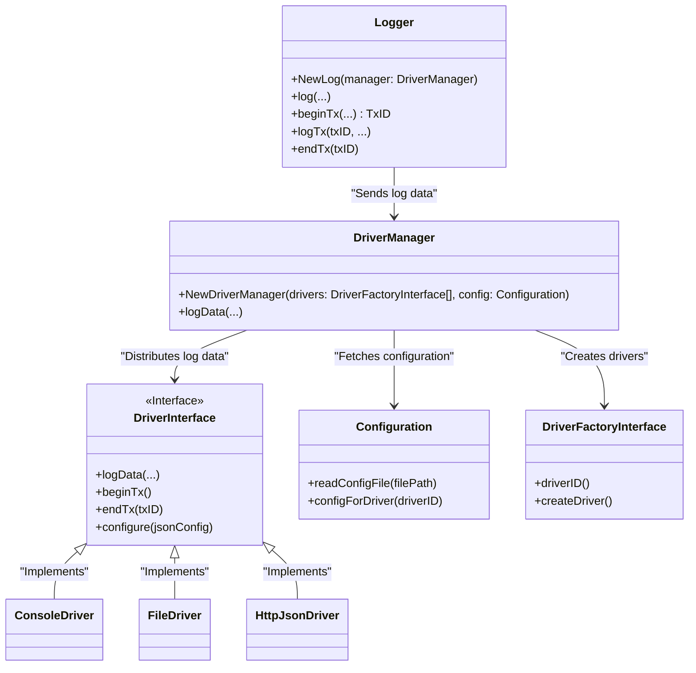
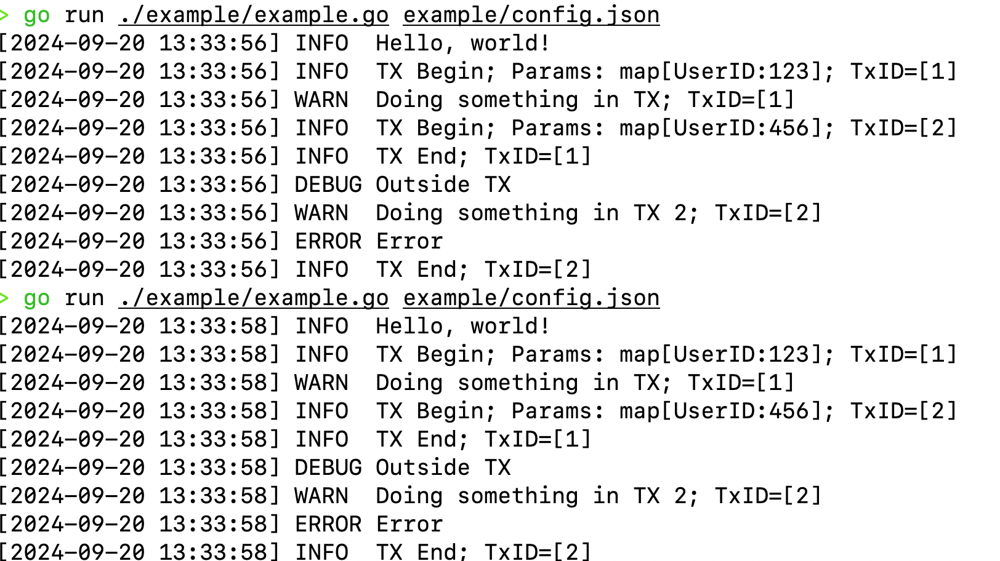
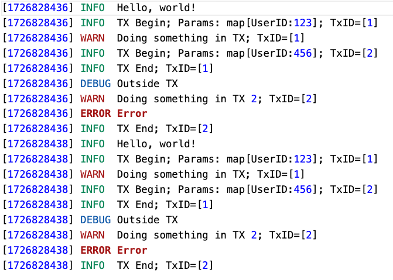
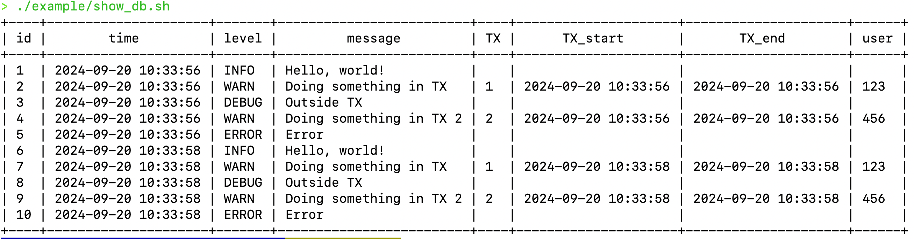

# Telemetry logging package prototype

## High level requirements

- Abstract the logging mechanism providers (drivers)
- Default drivers
  - Console
  - File/JSON
  - Network (HTTP)
- Supports preventive maintenance and post incident debugging
- Features
  - Data structure (protocol)
    - Attributes: Key-value pairs
      - Predefined attributes (key uint32 value fixed payload size, key-based)
        - Timestamps
        - Log levels: Info, Debug, Warning, Error
        - Context
        - Transaction ID
      - Application-related string based key value (e.g. Customer ID, Component level)
  - Transactional logging
- Configurable: Customizable by a configuration file without touching the core code or
the code which uses this package.

## Architecture considerations

The clear point of abstraction is at driver level where we need a common interface for data ingestion for logging providers. This will be described by `DriverInterface`. Also `DriverFactoryInterface` is responsible for lazy loading of providers (based on loaded configuration).

The usage API could be also abstracted but this looks like premature optimization and better to be implemented later when the clear need is identified.

`DriverManager` will provide a central point of managing the available drivers with the following responsibilities:

- Registering drivers
- Distributing the log data to the registered drivers
- Configuring the drivers
- Managing the driver lifecycle
- Should not be responsible for the data structure of the log data

`Configuration` will be responsible for reading the configuration file and providing the configuration to the `DriverManager`.

`Log` will be the main API for the users to log the data. It will be responsible for creating the log data and passing it to the `DriverManager` to distribute it to configured drivers.

The following diagram shows the high level architecture of the package.



## Next stage considerations

- The manager doesn't provide multi-threading support in order to allow drivers that already use a multi-threading model to benefit from the missing overhead. The `serial_driver.go` is an example on a proxy driver that provides serial access to the underlying driver, e.g. for streaming character devices.
  - In the same manner we could build a proxy driver for in memory buffering and then commit, based on some specific heuristics and specific configuration.
- Provide a global log instance that logs to console to seamless use without a specific configuration
- Better handing and precision for the timestamp for short event telemetry (e.g. nanoseconds)
- Enhanced error handling; propagate error from drivers where it makes sense

## Debugging and testing

Running tests

```sh
> go test . -v
=== RUN   Test_loadConfig
=== RUN   Test_loadConfig/empty
=== RUN   Test_loadConfig/two_drivers
=== RUN   Test_loadConfig/invalid_json
--- PASS: Test_loadConfig (0.00s)
    --- PASS: Test_loadConfig/empty (0.00s)
    --- PASS: Test_loadConfig/two_drivers (0.00s)
    --- PASS: Test_loadConfig/invalid_json (0.00s)
=== RUN   TestDriverManager_FailToCreateDriver
--- PASS: TestDriverManager_FailToCreateDriver (0.00s)
=== RUN   TestDriverManager_beginTx
--- PASS: TestDriverManager_beginTx (0.00s)
=== RUN   TestDriverManagerIntegration
--- PASS: TestDriverManagerIntegration (0.00s)
PASS
ok  	logsystem	0.296s
```

Continuous testing example

```sh
nodemon --ext "*.go" --exec 'sh -c "go test . -v -run TestDriverManagerIntegration" || exit 1'
```

Run the example

```sh
go run example/example.go example/config.json
```

Check the output

- Console for having human readable output for timestamp
  - 
- `example.log` for file output with unix timestamp
  - 
- `example.db` for structured output
  - run `./example/show_db.sh`
    - 